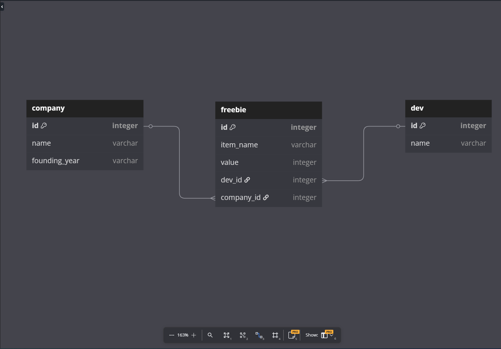

# Freebie Tracker
A simple Python app for developers to keep track of all the freebies (aka swag) they receive at hackathons and conferences. Built using SQLAlchemy and SQLite, the app models relationships between Companies, Developers, and Freebies.

# Project Structure
```
    freebie-tracker/
    │
    ├── models.py          # SQLAlchemy models and relationships
    ├── seed.py            # Sample data for testing
    ├── debug.py           # Debug tool to test methods in console
    ├── README.md          # Project overview
    ├── SETUP.md          # Project overview
    ├── migrations/        # Database migrations
    ├── database.db        # SQLite database (created after migration)
    └── Pipfile            # Pipenv dependencies
```

## Getting Started
1. Clone the Repo
```
git clone https://github.com/dennissammy77/freebie-tracker.git
cd freebie-tracker
```
2. Set Up Environment
Make sure you have pipenv installed:
```
pip install pipenv
```
install dependencies and activate the environment:
```
pipenv install
pipenv shell
```
3. Run Migrations
Use Alembic to generate and apply database migrations:
```
alembic upgrade head
```
4. Seed the Database
```
python seed.py
```
5. Start Debug Console
Test your models and methods in an interactive session:
```
python debug.py
```

## Database Schema


### Relationships
A Dev has many Freebies

A Company has many Freebies

A Freebie belongs to one Dev and one Company

Devs and Companies are connected via Freebies (many-to-many)

## Deliverables Implemented
Relationship Methods
Freebie.dev → Returns the associated Dev

Freebie.company → Returns the associated Company

Dev.freebies → All freebies the dev owns

Dev.companies → All companies from which dev got freebies

Company.freebies → All freebies distributed by company

Company.devs → All devs who got freebies from the company

## Custom Methods
Freebie.print_details() → "{dev name} owns a {item} from {company name}"

Company.give_freebie(dev, item_name, value) → Creates a new Freebie

Company.oldest_company() → Returns company with earliest founding year

Dev.received_one(item_name) → True if dev has a freebie with given item name

Dev.give_away(dev, freebie) → Transfers freebie ownership to another dev

